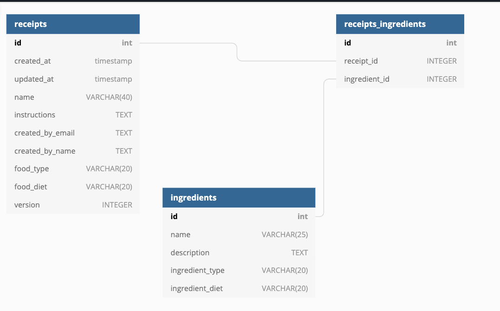

# safkalista-backend

This is the backend for "Safkalista" - an app that allows you to create your own weeks menu. Front-end code can be found [here](https://github.com/Silvast/safka-front)


## Database
The database uses flyway migrations. Add your database configuration to
 resources/default.edn such that both flyway and queries can access the
  db. 
 
 You can add your own database or use a test database with docker-compose
 , see /scripts/docker:
 
  ```
      $ docker-compose up db
      
  ```
  
 There is test data in afterMigration.sql
 to get you started. 
 
 To clean the database
 ```
     $ lein dbclean
     
 ```

 To run migrations
 ```
     $ lein dbmigrate
     
 ```
#### Structure of the database
 


## Installation and running
Clone this repo, set your database configuration in configuration/default.edn and run the server with
  
```
    $ lein ring server
    
```
Swagger site should open in http://localhost:3000/index.html
Alternatively, you can also use docker-compose 

```
    $ docker-compose up 
    
```
Or if you just need backend to develop frontend, you can also do:

```
    $ lein uberjar
    $ java -jar safkalista-backend-0.1.0-standalone.jar
```

## Tests 

```
    $ lein test
    
```

To run tests do (in the project root)

## License


Copyright © 2019 FIXME

Distributed under the Eclipse Public License either version 1.0 or (at
your option) any later version.
